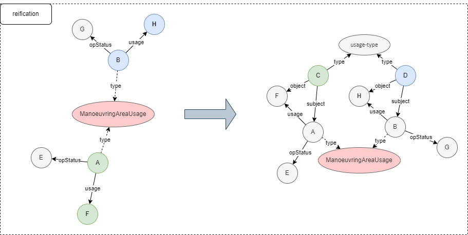
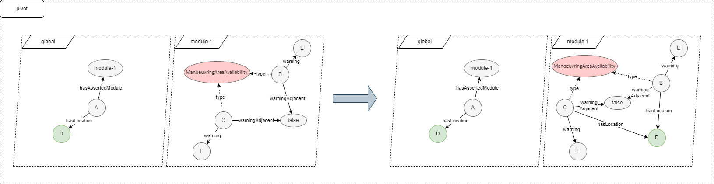
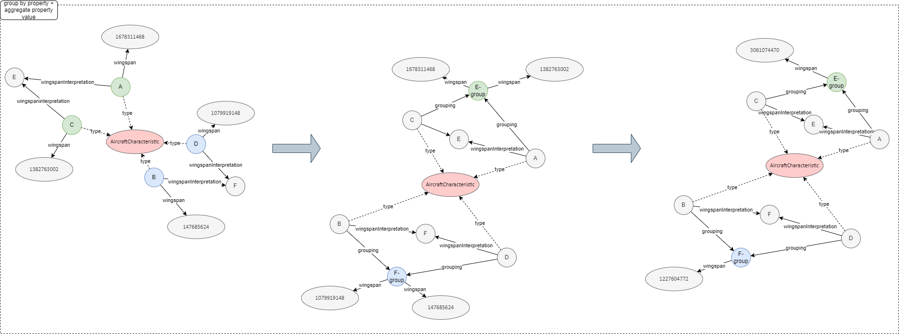
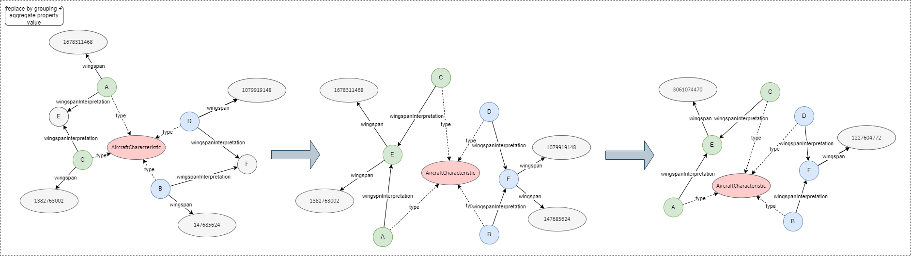
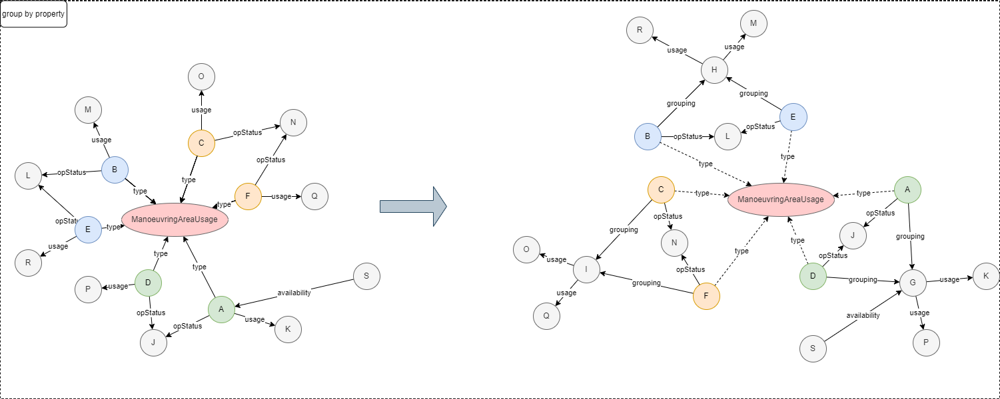
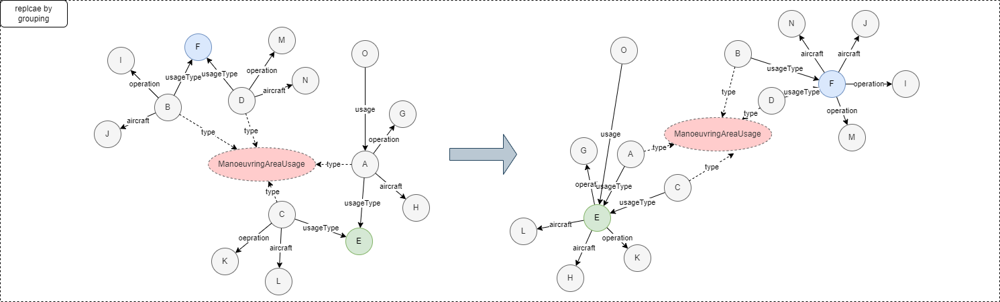

# **NQuadReader**
	todo:
	go through wording again	
	adding examples (RDF statements and mapping outputs and so on)

**getIdOfObject**

This methods basically creates a UUID which is a hash of a value since GraphX vertices have to have an identifier and then their value

Therefore a vertex basically is a tuple consisting of the value (the value that is contained in the base dataset, most of the time it’s already some sort of a URI) and then the MD5 hash of this value at the identifier: _Vertex = Tuple2 (MD5(value), value)_

**Operations - general**

Each method is one OLAP-function

For each OLAP-function there are two different methods

One uses the “ArrayList < String > contexts” parameter and therefore the operation is only done on all of the contexts that are defined in this list – the dataset is basically filtered by looking whether the RDF statement belongs to a context that is in the list

The other one ignores contexts and executes the operation on the whole dataset

Whenever the context list is used, it is transformed into a broadcast variable so that it can be used by all tasks at the same time when needed (My research said that was the only way to make it faster to go through collected lists in spark)

Generally speaking all the transformations have some sort of a similar logic:

 - Filtering triplets for a certain relationship type or subject type
 - Mapping the found triplets to new vertices and or new edges (by generating new values or replacing individuals with others)
 - Adding or replacing the vertices/edges with the new ones
 - Generating a new graph

**Illustrations – general**

Illustrations are going to be adapted however in general they do show the truth

At the moment for all illustrations in this document the following note has to be kept in mind:

***The type relationship is represented as an actual Edge, in the current implementation however, that would not look like that but the type relation is just added as a vertex-attribute directly***

**Reification – method “reify”**

 - This method basically performs reification on RDF statements that
   contains a certain predicate
   
 - and therefore creates a new individual (that represents the statement
   itself), another individual that represents the “type” of the
   statement 
   
 - and also three new edges that connect the statement individual to the subject, the object and the type-individual

the steps in the code are therefore as follows:

 - filter all the triplets of the graph that have the specified predicate
 - create the individual that should represent the type (the type individuals value has to be specified and the identifier is then created with the getIdOfObject method)
 - the type vertices is put in a list and parallelized to make it into a RDD since it later has to be joined with the other vertices to create the new, transformed graph
 - then all of the filtered statements from the first step are mapped to a new tuple4 which contains:
	 - the subject of the statement
	 - the object of the statement
	 - a new resource that represents the statement as an individual
	 - the context for which the statement is valid
 - those Tuple4s are then further processed by adding a 5th attribute (making it a Tuple5) which is the ID of the newly generated statement individual which is generated with the “getIDofObject” method
 - out of the tuple5 then the new vertices are created for the statement which then results in a vertex of the following form: ***(ID, Statement)***
 - For the new edges three mappings from the Tuple5 RDD are needed
	 - New Edges with the statement as the subject, the subject-relation as the predicate (value of the edge) as well as the context and the subject of the statement as the object
	 - New Edges with the statement as the subject, the object-relation as the predicate (value of the edge) as well as the context and the object of the statement as the object
	 - New Edges with the statement as the subject, the type-relation as the predicate (value of the edge) as well as the context and the generated type-individual as the object
 - Then all the already existing edges and vertices are joined with the new ones and a new transformed graph is created.

*C and D in the graphic are the newly generated statement-objects, “usage-type” is the newly generated type-individual*
  

**Pivot**

the steps in the code are therefore as follows:

 - Filter all the triplets of the graph that contain the
   dimensionProperty as a predicate (e.g. “hasLocation”, “hasDate”,..)
   and map those to new tuple which contain
   
 - The source Attribute + ‘mod’ (this then is the relevant context which is needed for the generation of new edges later)
 - The ID of the destination (object) edge (this is the value of the dimension e.g. ‘Linz’ or some date)
 - Those tuples are put into a hashmap since it will later be used to find the correct dimension value depending on the context for which it is applicable
 - Then the triplets are filtered again by finding statements in which the subject is of a certain type (selectionCondition) for example “ManoeuvringAreaAvailability”
 - Those filtered statements are then mapped to tuples with the following values
	 - The IDs of the subjects
	 - The context
	 - (Distinct is used since otherwise too many edges would be created later since there are a lot of statements where the fltered individual is the subject)
 - Then those tuples are mapped to new edges with
	 - The subject as the subject
	 - The applicable destination (e.g. Linz) depending on the contexts which is looked up in the hashmap
	 - A new relation (edge) containing the pirvotProperts (e.g. ‘object-model#hasLocation’)
 - Then the new edges are added to the old ones and a new transformed graph is created.
 - As it can be seen in the graph everything basically stays the same just that the subjects that are of type ManoeuvringAreaAvailability get a new Edge (within their context = module) that points to the dimension value (e.g. Linz)  

**aggregatePropertyValues (value-generating abstraction)**

the steps in the code are as follows:

 - Filter all the triplets that contain the aggregateProperty as predicate and map them to a pairRDD (a tuple) that contains:
	 - A tuple with the subject of the triplet and the context of the triplet
	 - The destination attribute (here we assume that it is always numeric)

The next steps are dependent on the type of aggregation that should be performed (sum, count, average, max or min)

 - New edges are created by mapping the tuples (that are of the form (tuple, numeric value)) to edges where the subject of the tuple within the tuple stays becomes the subject and the numeric value is aggregated depending on the type (e.g. when counting, the numeric value is mapped to 1 and then just summed, when summing the actual values are summed and so on)
 - New vertices are created by doing the same aggregation/calculation and then storing the result as the value of a the new vertex and generating an ID by again using the getIDOfobject method
 - Then the new edges and vertices are added to the old ones (the statements that were aggregated are removed) and a new transformed graph is created

**Group by property (individual generating abstraction**

the steps in the code are as follows:

 - Filter all triplets that contain the groupingProperty as predicate (the destination individual is the object by which the subjects of the triplets should later be grouped
 - Map those to new Tuples that represent the “Group” that should later replace all individuals belonging to that group à just adding the String “-Group” to the already existing value
 - For each filtered triplet: generate a new edge that represents the link between the subjects and their grouping individual they belong to
 - Put all the subjects that should be replaced and their replacement-Group into a hashmap
 - Then go through all triplets of the graph and find statements where individuals are present that should be replaced (according to what is in the hashmap) and create new edges where the individuals are replaced or stay the same
 - Created a new graph from the new edges and old and new vertices

**Replace by Grouping (triple generating abstraction)**

the steps in the code are as follows:

 - Filter all triplets that contain the groupingValue as the predicate and where the subject is of a certain type (replacementObject) and map them to edges
 - Put all of them (the subjects – individuals that should be replaced – and their replacement into a hashmap
 - Then go through all triplets of the graph and find statements where individuals are present that should be replaced (according to what is in the hashmap) and create new edges where the individuals are replaced or stay the same
 - Create a new graph out of the old vertices and the new edges

# **GraphGenerator**

The Graph Generator class is basically there to create a new initial base Graph directly from the data source. It therefore in my case takes an NQ-File and analyses each row. It creates GraphX Vertices from all the subjects and objects in the RDF statements, then it created Edges using the created Vertices and assigning the RDF-predicate as the value of the GraphX Edge. Also the Graphname within the RDF statements is also stored in the Edge as an additional Attribute.

It is important to note that in general every RDF statement is translated into one GraphX Edge. However all RDF statements that describe a type-relation (predicate = [http://www.w3.org/1999/02/22-rdf-syntax-ns#type](http://www.w3.org/1999/02/22-rdf-syntax-ns#type) is not stored as an edge but the type property is directly stored with the subject-vertice.

**getJavaRDD**

This method loads a nquad-File and reads every line of it and creates a quadriple (class quad) for each valid line (not empty, not a comment, length >1) and stores it in a JavaRDD< Quad > which is then returned

**generateGraph**

 - the generateGraph method first uses the getJavaRDD method to generate the JavaRDD of quads.
 - Then all statements are are searched that do not contain the type-relation as predicate.
 - All subjects of such statements are mapped to a new vertex (of type Resource since there can only be Resources and no Literals in the subject of a RDF statement)
 - All objects are also mapped to a vertex but it is first checked whether it is a literal (then the literal value is used as the vertex attribute) or if it is also a resource (then the whole resource – the uri – is used as the vertex attribute)
 - Then all statements with the type-relation are searched and mapped to
   new tuples with ID and the vertex itself which is constructed by the
   subject itself and also the object of the type-relationship statement
   
 - Then the vertices without a type are used and the vertices with a type are "substracted" (removed) from them since we want to use the ones that have the type as an attribute rather than the ones that do not have this information
 -  then the rest of the vertices without a type that stayed after the substraction are combined with the vertices that have a type
 -  those are then mapped to new tuple2 of type < Object, Object> since otherwise GraphX does not allow graph generation
 - then the graph is generated out of the edges and vertices and returned
   

**Relation**

 - Edges are of the Type “Relation”. The relation class represents the
   relation between two vertices  - or rather the attributes of the
   Edge. The attributes that are used are:
	
	 - The “relationship” which is basically the predicate of the original
   RDF statement
   
	 - The “Context” which is the URI of the named graph the relation
   belongs to
  
	 - The “targedatatype” which stores either the type of the literal   
   (Integer, String, Boolean,..) of the object of a RDF statement or the
   String “Resource” when it’s not a literal but a resource (URI) so   
   that when aggregating for example it could be made sure that only   
   integer values are summed up and so on (this was an idea at the   
   beginning however it is not really used at the moment but I guess it 
   is still good to have)

# **Vertex – Resource – Literal**

I used the Vertex interface in order to be able to create the initial Graph in “GraphGenerator” where I have some functions that accept Resources AND Literals in the same collection so I needed some sort of interface or abstract class as a placeholder (Maybe there is a better way to do so or to use the interface differently or change it to an abstract class?)

The Classes Resource and Literal then implement the Interface.